# RhythmPunch

[[다운 링크]](https://github.com/2025-3/RhythmPunch/releases/tag/Release) &nbsp; [[Web 플레이 링크]](https://2025-3.github.io/RhythmPunch/)

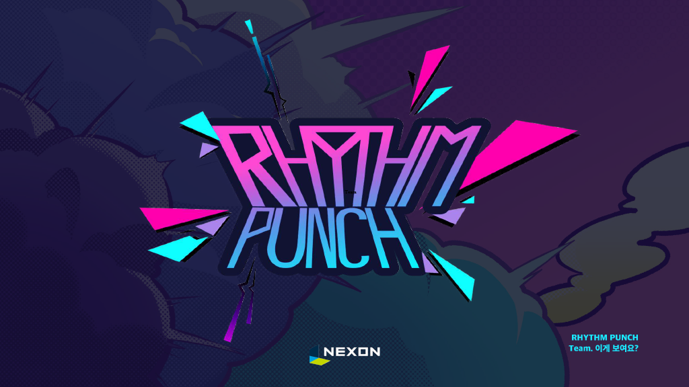
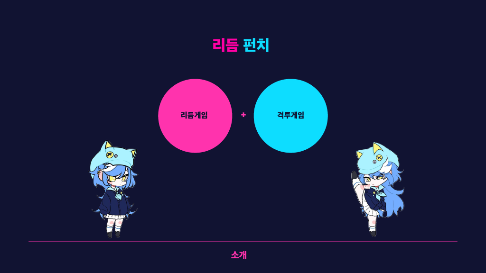
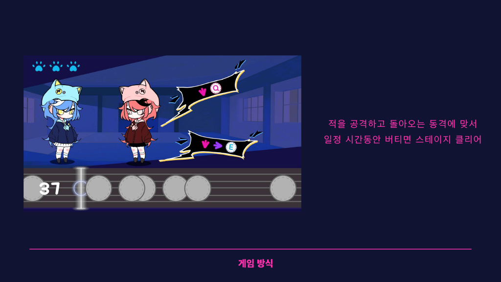
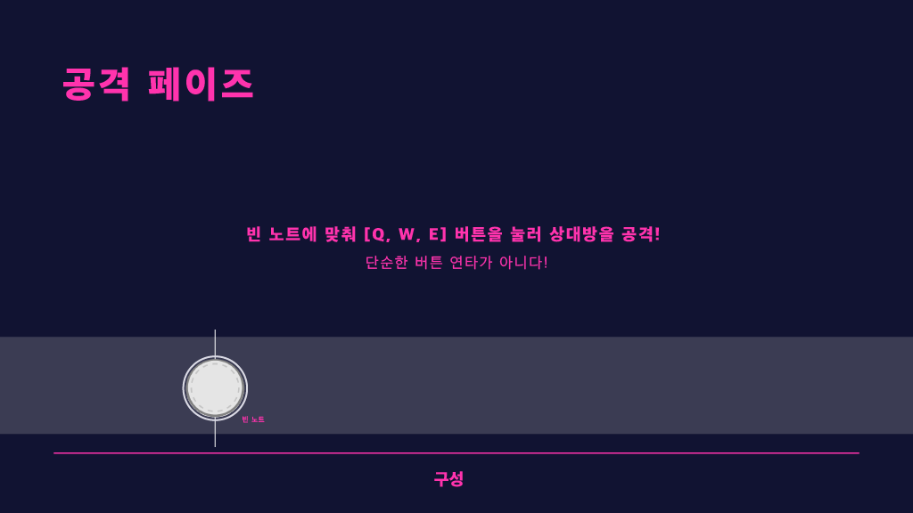
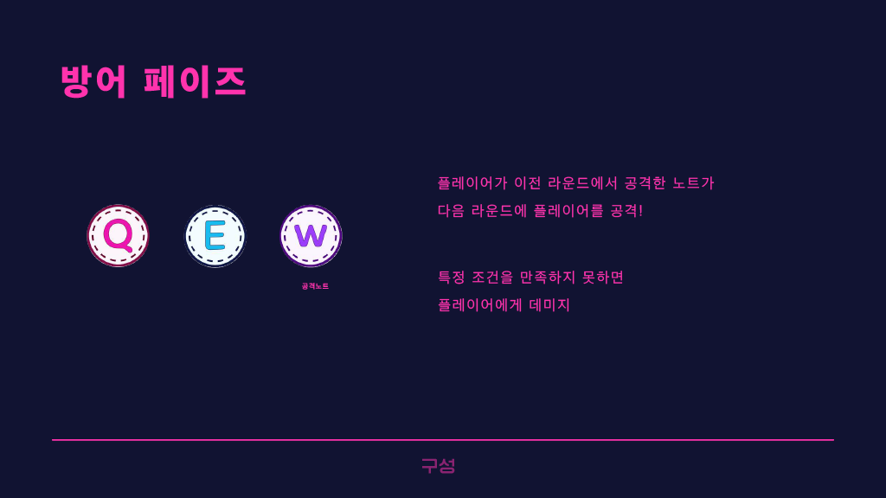
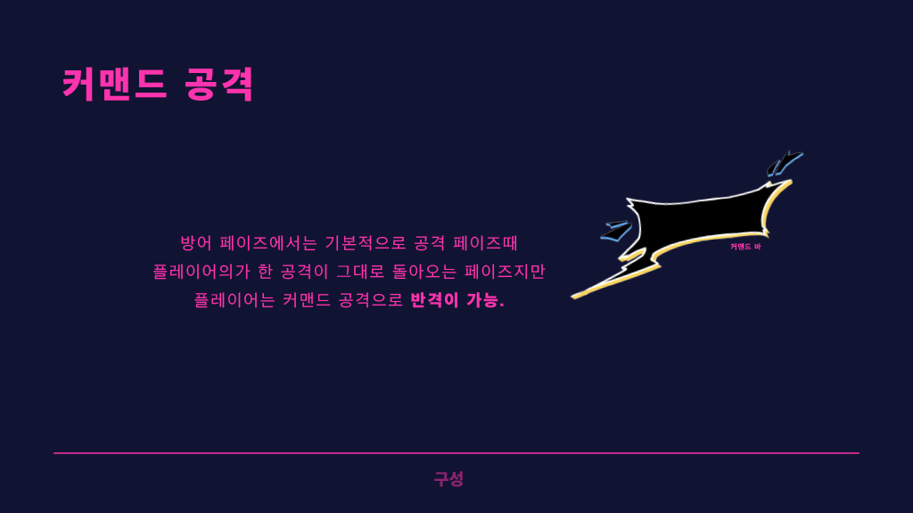
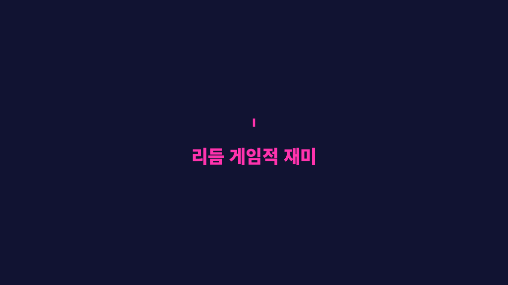
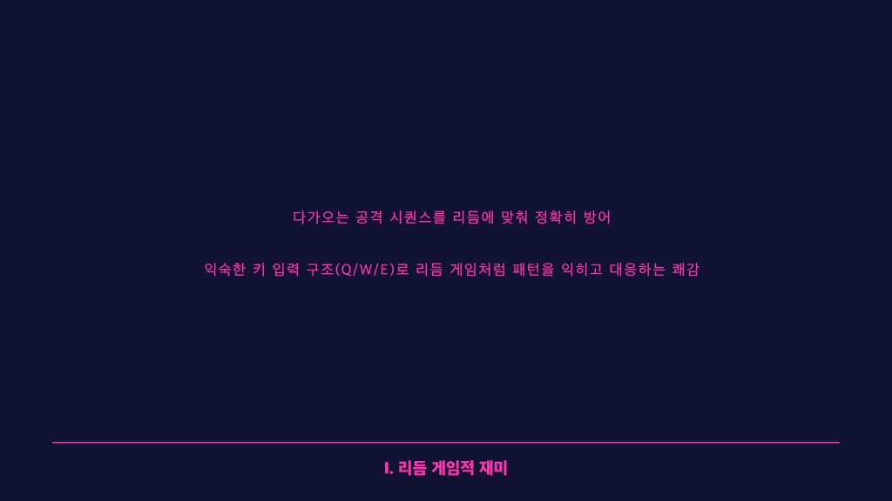
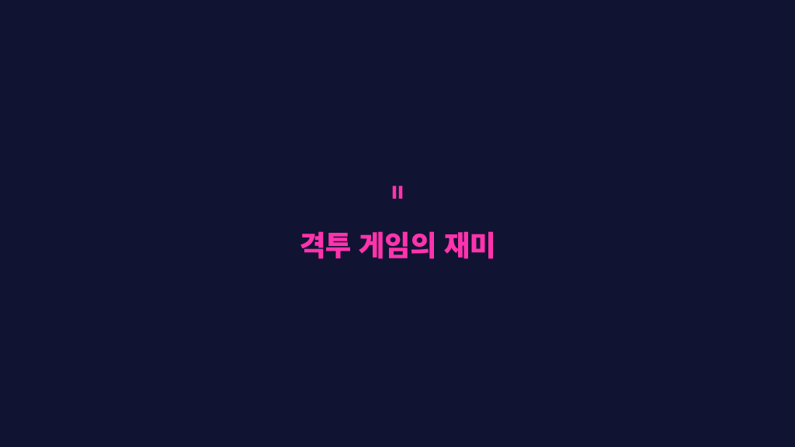
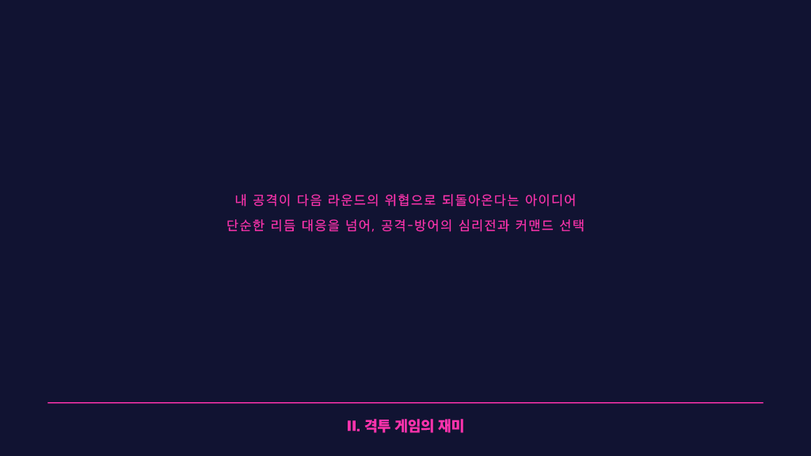
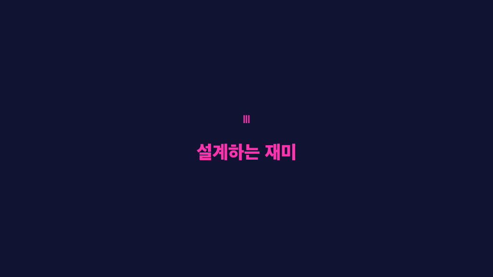
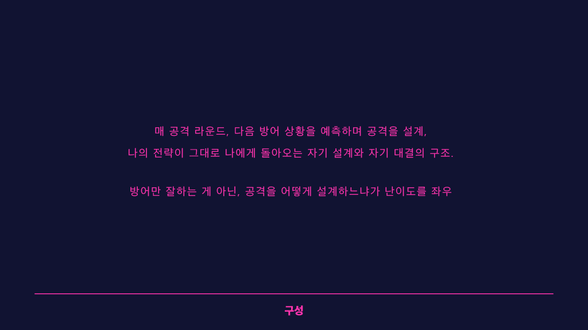

---

### history

#### ver 0.2
 - 취약점이 패치된 Unity 버전으로 변경
 - 스테이지를 시작해도 노트가 등장하지 않는 오류 수정
 - Web버전에서 플레이 가능하도록 오류 수정
 - Web버전에서는 종료 버튼이 나오지 않도록 변경
 - 두 번째로 플레이하는 스테이지부터 노트 효과음이 나오지 않는 오류 수정
 - 방향키 커맨드 입력 정보가 공격키를 입력해도 남아있는 오류 수정
 - 판정과 노트 움직임을 음악에 일치하도록 수정

### ver 0.1
 - 출시